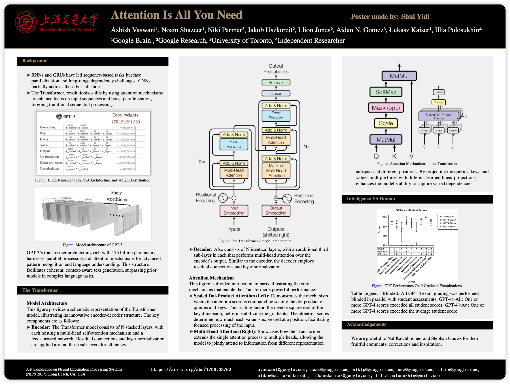
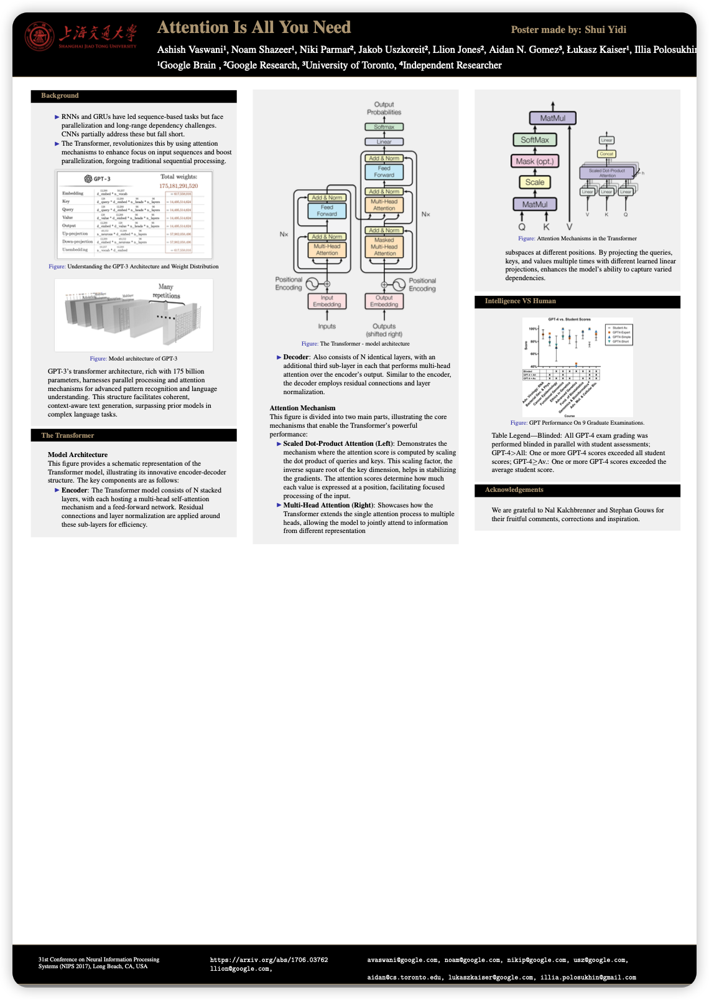

# sjtu-poster

## Description

This is a LaTeX template for SJTU poster. The template is based on the `beamer` class and the `beamerposter` package. The template is designed for the poster of SJTU, but it can be easily modified for other universities.

This template has been tested on TeX Live 2023 with compiling engine `XeLaTeX`.

This template has refered to the following templates, and made some modifications to better fit the modern compiling engine such as `XeLaTeX`:

[Purdue poster template](https://github.com/abarbu/purdue-beamer)

## Usage

You can directly use the file `example.tex` to start your poster. The file provide several examples to help you understand how to use this template.

You can modify the author name in the line 116 in `beamerthemeSJTU.sty` file:

```latex
\usebeamercolor{title in headline}{\color{fg}{\Large Poster made by: Your name}}\\[1.5ex]}}
```

You can choose to use the landscape or portrait mode by changing the `width` and `height` in the following line(if you want to use the custom size like in the example):

```latex
\usepackage[orientation=landscape,size=custom,width=135.46667,height=101.6,scale=1.5]{beamerposter}
```

You can also use the default size by replacing with the following line:

```latex
% landscape mode
\usepackage[orientation=landscape,scale=1.5]{beamerposter}
% portrait mode
\usepackage[orientation=portrait,scale=1.5]{beamerposter}
```

> Since this template use the package minted to highlight the code, you need to install the package `python` and `pygments` to make it work. If you don't want to use the package `minted`, you can simply comment the following line in the `example.tex`:

```latex
% \usepackage{minted}
```

Here is a brief introduction of the minted package:
<https://www.overleaf.com/learn/latex/Code_Highlighting_with_minted>

## Example

- Landscape



- Portrait


